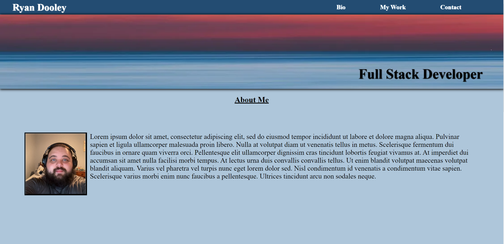
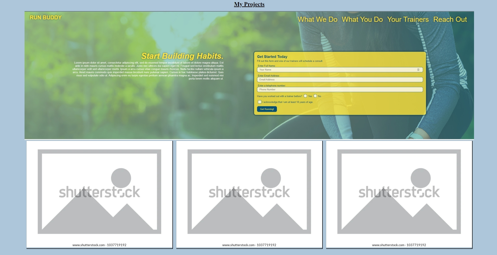
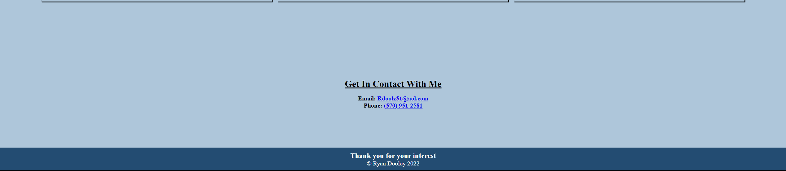

# RDPortfolio
This is the first iteration of my Portfolio website. 

This website displays my first project(run buddy) and has 3 placeholders ready to hold my next 3 projects!

This website has a recent photo of me and a place for a description of me. (I'll fill that out in a later draft once I understand the type of jobs i want to be applying for)

Deployed Site: https://rdoolz51.github.io/RDPortfolio/
 
Repository Link: https://github.com/Rdoolz51/RDPortfolio

